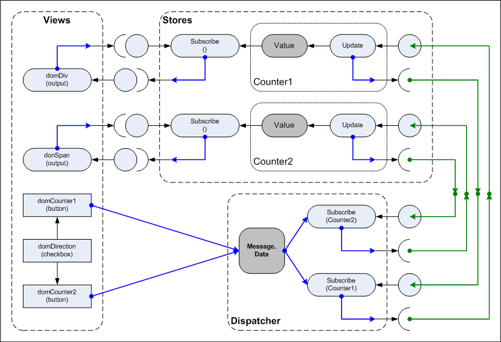

# FLUX-Sampler
##A UI pattern inspired by the Facebook FLUX model

In this sampler I have developed a UI model inspired by the Facebook FLUX pattern. This consists of the following components:

* Dispatcher: hub for all Actions ()messages and data) to be processed.
* Models: data sets (states) being maintained. These subscribe to the Dispatcher so they can be notified of any Actions that might affect them.
* Views: User Interface elements that subscribe to the relative models they present.

### The Scenario

The Scenario used in this Sampler consists of two models each with its own view. 
The models are simple integer counters shown through a div and span respectively. 
Two buttons issue Actions to update the respective Model by +1 or -1 based on the value of a checkbox.

#### Sequence
As illustrated above:

* A button fires an Action as a post in to the Dispatcher.
* The Dispatcher forwards the message, and any associated data from the post, to all subscribing Models.
* Affected Models use the information forwarded in the call-back to update the state before,
* issuing an update to subscribing Views.
* The Views present the updated values as they see fit.

